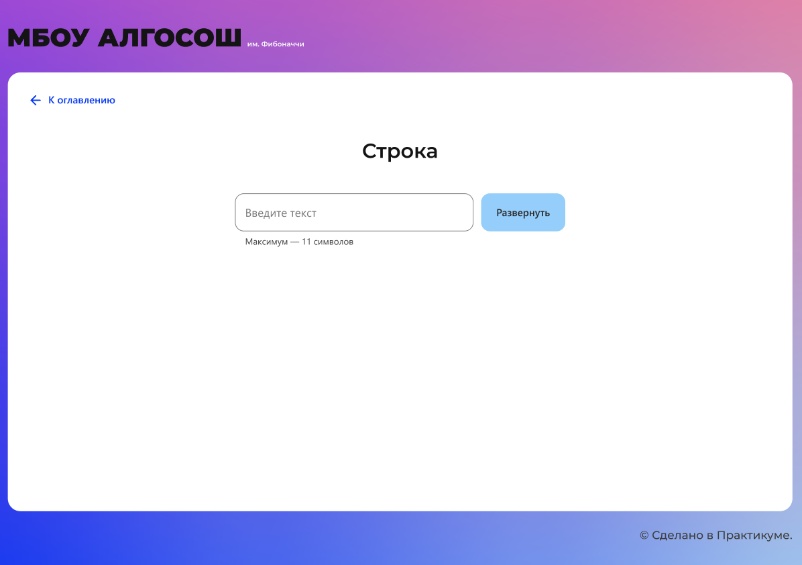

# Проект. МБОУ АЛГОСОШ им. Фибоначчи

- [Макет в Figma](#figma)
- [Какие навыки приобрела в этом спринте](#skills)
- [Описание проекта](#about)
- [Стэк технологий](#stack)
- [Ссылка на проект GitHub Pages](https://krekser37.github.io/St_burgers/)

<a name='figma'>**Макет в Figma**</a>

[Ссылка на макет в Figma](https://www.figma.com/file/RIkypcTQN5d37g7RRTFid0/Algososh_external_link?node-id=0%3A1)

<a name='skills'>**Какие навыки приобрела в этом спринте**</a>

1. Научилась создавать и структурировать проект на React.
2. Научилась создавать компоненты и управлять потоками данных.
3. Освоила функциональный подход к разработке на React и написала код с помощью хуков.
4. Освоила алгоритмические подходы к решению задач.
5. Узнала методы оценки сложности алгоритмов: пространственную и временную сложность.
6. Структурировала всю бизнес-логику приложения и использовала ее.
7. Узнала алгоритмы сортировки: быструю, выбором и слиянием.
8. Ознакомилась с линейными структурами данных: стек, очереди, списки.
9. Научилась определять оптимальные для работы приложения алгоритмы, что поможет существенно ускорить время вычислений и уменьшить объём используемой памяти.
10. Продолжила применять TypeScript.

<a name='about'>**Описание проекта**</a>

В данном проекте написала визуализатор алгоритмов, его анимацию и поэтапное отображение работы, что позволяет понять каждый шаг его работы.

Строка

На этом экране предстоит развернуть строку.

Начальное состояние страницы

Введите текст в инпут и нажмите развернуть.

Сначала на экране появляется слово, буквы которого записаны в синие кружки.

Строка в исходном виде

Два кандидата на сортировку подсвечены цветом `#D252E1`. Уже отсортированные элементы выделены `#7FE051`.

На скриншоте показана строка, в которой поменяли местами крайние символы:

Промежуточный этап разворота строки

Выделение повторяется, пока полностью не развернётся строка.
Анимация выполняется плавно.

Последовательность Фибоначчи

На этом экране предстоит сгенерировать `n` чисел последовательности Фибоначчи.

Начальное состояние страницы

Например, ввели 4, тогда на экране появиться ряд 1, 1, 2, 3, 5. В инпут можно вводить только положительные целые числа. И так как последовательность бесконечна, добавлена максимальная граница ввода 1 ≤ `n`≤ 19.

Элементы отображаются постепенно. Сначала появляется один, потом второй, третий и так до `n`. Пока ряд появился не полностью.

Сгенерированная последовательность

Анимация выполняется плавно.

Сортировка массива

На этом экране визуализированы алгоритмы сортировки выбором и пузырьком по возрастанию или по убыванию.

Начальное состояние страницы

Задается рандомный массив случайных целых чисел $[0; 100]$, минимальное количество элементов массива `minLen = 3`, максимальное `maxLen = 17`. Максимальное значение элемента массива равно 100, это же значение является процентным соотношением высоты столбца. В качестве максимальной высоты взяли 340px.

Когда нажимаете «По убыванию» или «По возрастанию», запускается процесс сортировки в зависимости от выбранного способа: выбором или пузырьком.

Сортировка массива выполняется плавно.

Стек

На этом экране визуализировано удаление и добавление элементов в структуру данных стек

Начальное состояние страницы

Если ввести в инпут значение и нажать «Добавить», в стеке появляется первый элемент, который необходимо отрисовать на странице.

Инпут очищается после добавления элемента в стек.

При добавлении ещё одного элемента справа от предыдущего появляется Circle с новым значением и индексом 1. И теперь уже над ним отображается подпись `top`. В момент добавления на долю секунды подсвечивается новый элемент цветом `#D252E1`.

Если в инпуте нет числа, по клику на кнопку «Добавить» метод `push(item)` не вызывается.

Если нажать «Удалить», из стека извлекается только верхний элемент. Удаляемый элемент выделяется цветом, надпись `top` перемещается на его левого соседа.

Если в стеке всего один элемент, то после нажатия «Удалить» на странице не отображаются никакие элементы стека.

По клику на кнопку «Очистить» из стека удаляются все элементы сразу.

Очередь

На этом экране визуализированы удаление и добавление элементов в структуру данных «очередь».

Начальное состояние страницы

Если ввести в инпут значение 2 и нажать «Добавить», элемент отображается под индексом 0. Также на элементе есть указатели `head` и `tail`. Инпут при этом очищается.

Очередь с одним элементом

При добавлении элементов в очередь позиция tail смещается, на долю секунды новый элемент выделяется цветом `#D252E1`.

Очередь из трёх элементов в момент добавления

Теперь если нажать «Удалить», из очереди извлекается элемент под индексом 0 (на долю секунды подсвечивается `#D252E1`), a `head` перемещается на элемент с индексом 1.

Очередь после `dequeue();`

Связный список

На этом экране реализованы удаление и добавление элементов в связный список.

Начальное состояние страницы

**При добавлении в head** элемент появляется над первым элементом вместо надписи head.

Добавление в head

Затем он занимает первое место в списке и на долю секунды выделяется зелёным цветом. Теперь над новым элементом написано head, и он указывает на предыдущий head-элемент.

Отображение нового элемента в head

**При добавлении в tail** элемент появляется в хвосте над элементом с надписью tail. Затем он занимает последнее место в списке и на долю секунды выделяется зелёным цветом. Теперь под новым элементом написано tail.

**При добавлении элемента по индексу** должны быть заполнены два поля: «Введите значение» и «Введите индекс». Вся анимация выполняется поэтапно:

- По клику на «Добавить по индексу» новый элемент отображается над первым элементом.
- Пока ищем нужный индекс, поочерёдно подсвечиваются элементы. Добавляемый элемент перепрыгивает по списку до искомого индекса.
- Когда индекс найден, отображается новый элемент над ним и добавляется.

В этом примере число 10 должно занимать индекс 2.

Добавление по индексу. Поиск индекса

После успешного добавления 10 стоит под порядковым номером 2 и указывает на 34. Новый добавленный элемент выделите цветом. Через долю секунды все цветовые выделения и лоадер на кнопке — вставка завершена.

Добавление по индексу. Новый элемент в списке

**При удалении элемента по индексу** сначала выделяются цветом элементы, пока не достигнем нужного индекса. Затем очищается значение в элементе и снизу отображается маленький кружок с удаляемым значением.

Например, ввели индекс 2 и нажали «Удалить по индексу». Сначала цветом выделяется элемент с индексом 0, потом с индексом 1, и когда дошли до нужного индекса, то удаляется элемент из связного списка:

Удаление элемента под индексом 2

**При удалении элемента из tail** кружок замещает надпись tail.

Удаление элемента из tail

При удалении новый элемент отображать под элементами списка.

<a name='stack'>**Стэк технологий**</a>

             
  
 <a name='project'>**Ссылка на проект GitHub Pages**</a>

* [Ссылка на проект GitHub Pages](https://krekser37.github.io/algososhMy/)

Спасибо!
